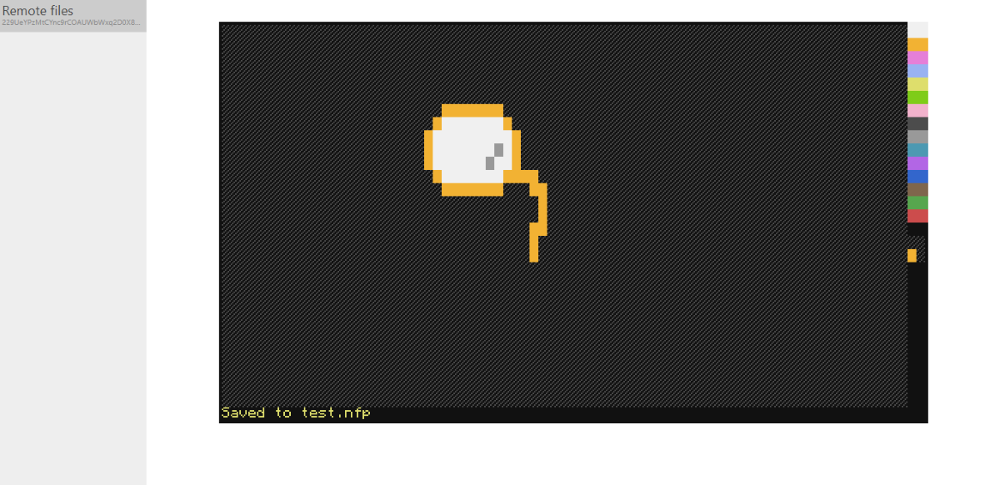
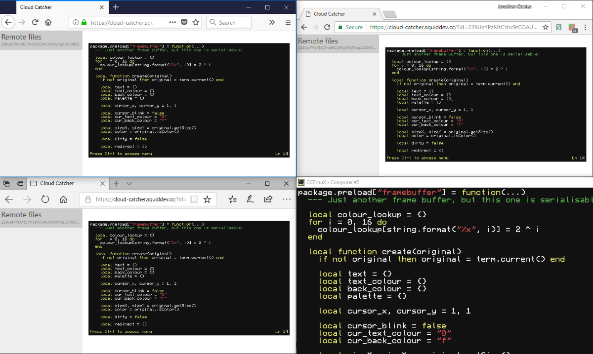

# Cloud Catcher

A web interface for ComputerCraft computers

## Getting started
 - Visit https://cloud-catcher.squiddev.cc/
 - Follow the instructions there
 - One can run `cloud edit <filename>` to edit a file remotely.

## Features

Interact with a computer remotely.

Open any remote file for inspection, make some modifications, and save it back
to the computer.

Share your session with other people, allowing for a true multiplayer-notepad.
